# SOFTWARE REQUIREMENTS SPECIFICATION

# BikeFlow

## Table of Contents

1. [User Specification](#1-user-specification)
   - [1.1. Introduction to the Problem Domain](#11-introduction-to-the-problem-domain)
   - [1.2. User Requirements](#12-user-requirements)
2. [System Specification](#2-system-specification)
   - [2.1. Use Case Diagram](#21-use-case-diagram)
   - [2.2. Use Case Tables](#22-use-case-tables)
   - [2.3. Class Diagram](#23-class-diagram)
   - [2.4. Activity and Sequence Diagrams](#24-activity-and-sequence-diagrams)
   - [2.5. State Diagrams](#25-state-diagrams)
3. [Acceptance Tests](#3-acceptance-tests)
4. [Project Planning](#4-project-planning)
   - [4.1. Gantt Chart and Work Breakdown Structure](#41-gantt-chart-and-work-breakdown-structure)
   - [4.2. Network Diagram](#42-network-diagram)

------

## 1. USER SPECIFICATION

### 1.1. Introduction to the Problem Domain

#### Background

Bike sharing is a service where people can rent bicycles for short trips around the city. The system has two main users: administrators (who own the bikes) and customers (who rent them).

#### How It Works

Customers register in the system through a mobile app or website. They can see available bikes on a map, rent a bike by scanning a QR code, ride to their destination, and return it to any station. The system calculates the cost based on rental time.

Administrators manage the entire system remotely. They can see all bikes, check their condition, set prices, and schedule maintenance. The system automatically alerts them when bikes need service.

#### Business Rules

**Pricing:**

- Different prices for different times (weekday/weekend, day/night)
- First 30 minutes often free
- Special discounts for students or promotions

**Stations:**

- Located near metro, bus stops, universities, city center
- Each station has limited capacity for bikes

**Maintenance:**

- After 500 km: check brakes and gears
- After 1000 km: full inspection
- Monthly cleaning and chain lubrication

### 1.2. User Requirements

#### User Goals:

- **G1:** Easy bike access (quick location and rental)
- **G2:** Transparent pricing (known cost upfront)
- **G3:** Safe bikes (good working condition)

#### Administrator Goals:

- **G4:** System control (monitor bikes, users, and revenue)
- **G5:** Efficient maintenance (automated service alerts)

#### Functional Requirements

- **FR-1:** User Registration (email, phone, payment method)
- **FR-2:** Bike Search (real-time map of available bikes)
- **FR-3:** Rent Bike (unlock via QR code scan)
- **FR-4:** Return Bike (automatic rental end when bike is locked at a station)
- **FR-5:** Payment Processing (automatic calculation and charging)
- **FR-6:** Rental History (storage of trip and payment records)
- **FR-7:** Tariff Management (admin-configurable pricing plans)
- **FR-8:** Maintenance Tracking (automated alerts based on usage/distance)
- **FR-9:** Bike Monitoring (real-time tracking of location, status, and battery)
- **FR-10:** Notifications (email/SMS for confirmations and promotions)

#### Non-Functional Requirements

- **NFR-1: Performance**
  - Support for 1,000 concurrent users
  - Response time under 1 second for 95% of requests
- **NFR-2: Availability**
  - 99% uptime
- **NFR-3: Security**
  - Data encryption (HTTPS)
  - Secure password hashing
  - Payment data security compliance
- **NFR-4: Usability**
  - Registration in under 5 minutes
  - Rental process completed in 3 clicks or fewer
- **NFR-5: Compatibility**
  - Mobile app for iOS and Android
  - Web version for Chrome, Firefox, Safari

#### Domain Requirements

- **DR-1:** Safety Standards (functional brakes, lights, bell)
- **DR-2:** Age Restriction (users must be at least 16 years old)
- **DR-3:** Data Protection (GDPR compliance)

------

## 2. SYSTEM SPECIFICATION

### 2.1. Use Case Diagram

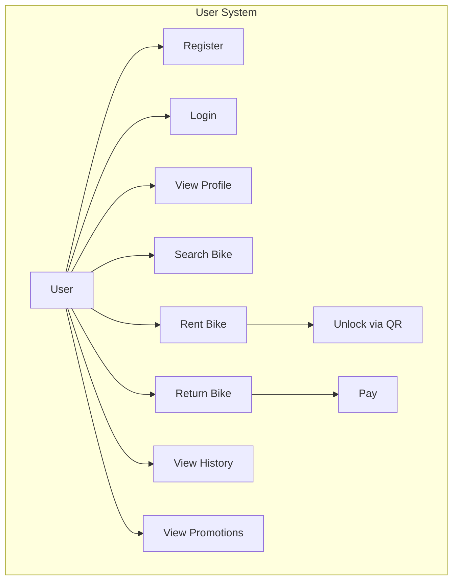

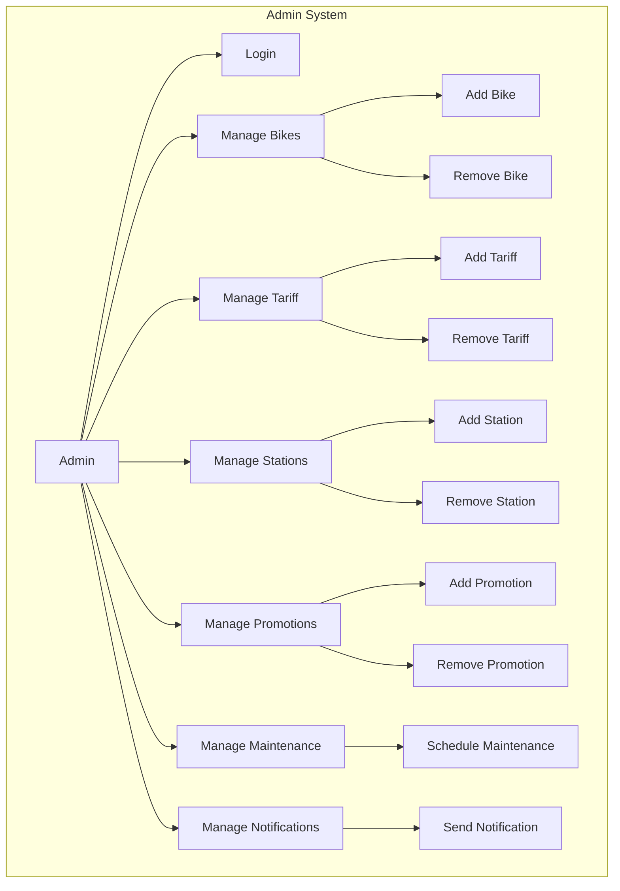

### 2.2. Use Case Tables

**Manage Bicycles**

| Attribute          | Value                                                        |
| ------------------ | ------------------------------------------------------------ |
| **ID**             | UC-2                                                         |
| **Title**          | Manage Bicycles                                              |
| **Author**         | BikeShare Team                                               |
| **Preconditions**  | 1. Administrator is logged in (UC-1)                         |
| **Description**    | Add, remove or update bicycles in system                     |
| **Steps**          | 1. Administrator selects bicycle management function<br>2. System displays bicycle fleet<br>3. Administrator performs operation (add/remove/update)<br>4. System confirms operation completion |
| **Postconditions** | 1. Bicycle fleet is updated                                  |
| **Exceptions**     | E1: Invalid bicycle data (Step 3)                            |
| **Comments**       | None                                                         |
| **References**     | FR-9                                                         |

**Configure Pricing**

| Attribute          | Value                                                        |
| ------------------ | ------------------------------------------------------------ |
| **ID**             | UC-3                                                         |
| **Title**          | Configure Pricing                                            |
| **Author**         | BikeShare Team                                               |
| **Preconditions**  | 1. Administrator is logged in (UC-1)                         |
| **Description**    | Set and modify tariff plans                                  |
| **Steps**          | 1. Administrator selects tariff management<br>2. System displays current pricing plans<br>3. Administrator creates or modifies tariff rules<br>4. System saves pricing configuration |
| **Postconditions** | 1. Pricing rules are updated                                 |
| **Exceptions**     | E1: Invalid pricing configuration (Step 4)                   |
| **Comments**       | None                                                         |
| **References**     | FR-7                                                         |

---

#### Actor: Customer

**Rent Bike**

| Attribute          | Value                                                        |
| ------------------ | ------------------------------------------------------------ |
| **ID**             | UC-5                                                         |
| **Title**          | Rent Bike                                                    |
| **Author**         | BikeShare Team                                               |
| **Preconditions**  | 1. User is logged in<br>2. Bike is available<br>3. User has valid payment method |
| **Description**    | Reserve and unlock a bicycle                                 |
| **Steps**          | 1. User finds available bike on map<br>2. User scans bike QR code<br>3. System validates rental request<br>4. System unlocks bike<br>5. System starts rental session |
| **Postconditions** | 1. Bike unlocked<br>2. Rental session started                |
| **Exceptions**     | E1: Bike no longer available (Step 3)<br>E2: Payment method invalid (Step 3) |
| **Comments**       | None                                                         |
| **References**     | FR-2, FR-3                                                   |

**Return Bike**

| Attribute          | Value                                                        |
| ------------------ | ------------------------------------------------------------ |
| **ID**             | UC-6                                                         |
| **Title**          | Return Bike                                                  |
| **Author**         | BikeShare Team                                               |
| **Preconditions**  | 1. Active rental session exists                              |
| **Description**    | End rental session and return bicycle                        |
| **Steps**          | 1. User locks bike at station<br>2. System detects bike return<br>3. System ends rental session<br>4. System processes payment<br>5. System sends receipt |
| **Postconditions** | 1. Bike locked<br>2. Payment processed<br>3. Session ended   |
| **Exceptions**     | E1: Station full (Step 1)<br>E2: Payment processing failed (Step 4) |
| **Comments**       | None                                                         |
| **References**     | FR-4, FR-5                                                   |

### 2.3. Class Diagram

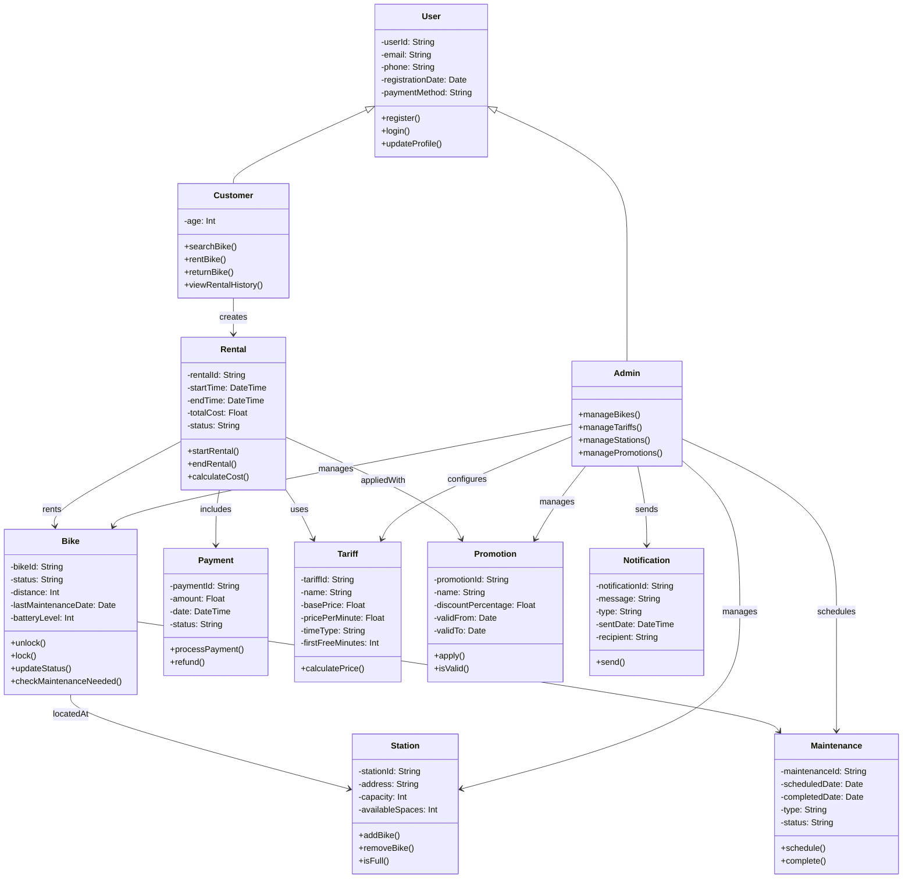

### 2.4. Activity and Sequence Diagrams

#### Sequence Diagram 1: Rent Bike

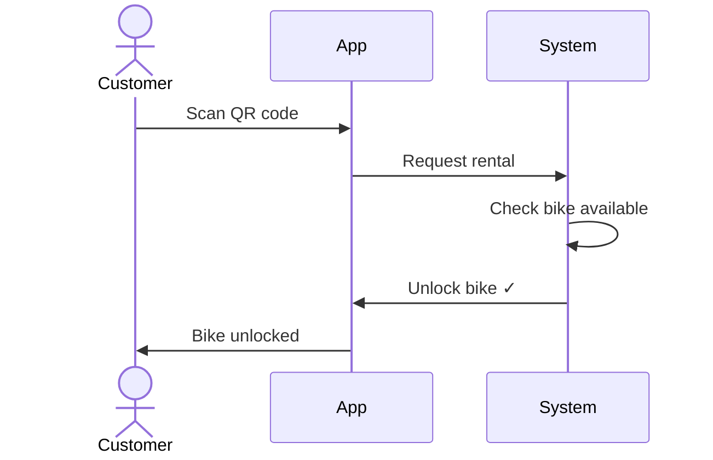

####  Sequence Diagram 2: Return Bike & Payment

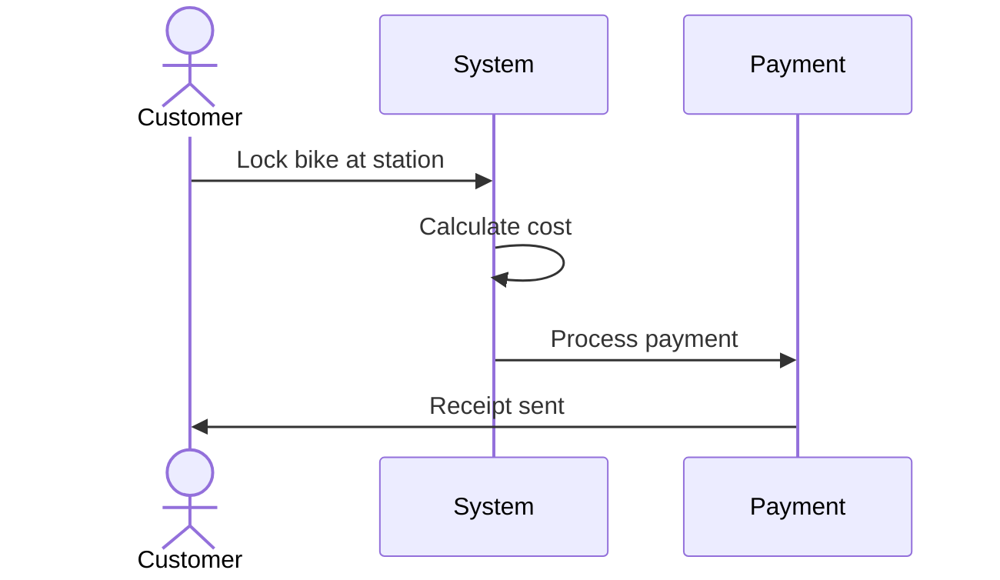

#### Activity Diagram 1: Rent & Return Workflow

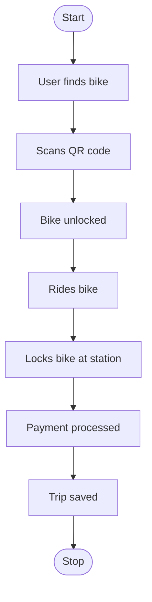

#### Activity Diagram 2: Admin Maintenance

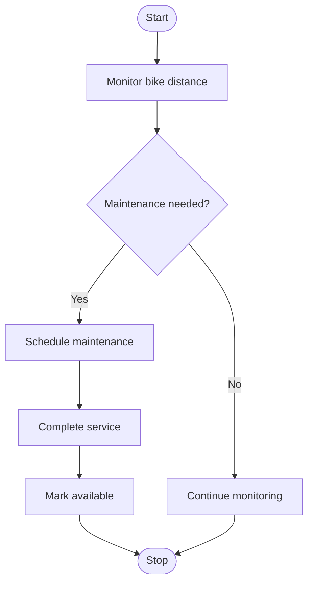

### 2.5. State Diagrams

#### Bike State Diagram

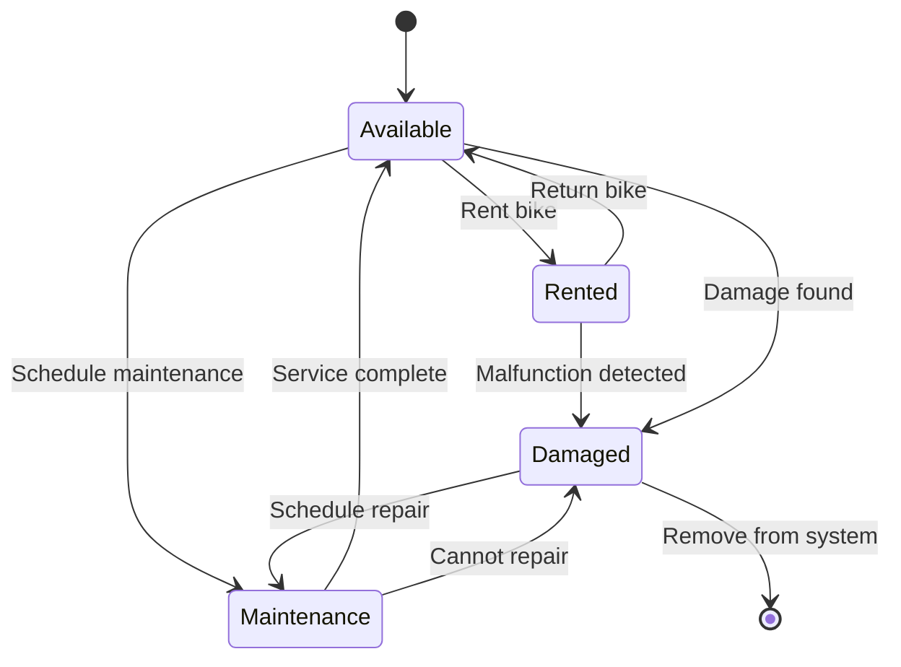
------

## 3. ACCEPTANCE TESTS

## Functional Acceptance Tests

### Test 1: Rent Bike Successfully

| Item | Description |
|------|-------------|
| **Test ID** | AT-F1 |
| **Use Case** | UC-5: Rent Bike |
| **Objective** | Verify customer can rent bike via QR code scan |
| **Input Conditions** | Customer logged in, bike available, valid payment method |
| **Output Conditions** | Bike unlocked, rental session started, GPS active |
| **Test Steps** | 1. Open app -> 2. Select bike -> 3. Scan QR -> 4. System validates -> 5. Bike unlocks -> 6. Rental starts |
| **Pass Criteria** | Bike unlocked, rental session created, GPS tracking active |

---

### Test 2: Return Bike and Process Payment

| Item | Description |
|------|-------------|
| **Test ID** | AT-F2 |
| **Use Case** | UC-6: Return Bike |
| **Objective** | Verify bike return, cost calculation, and payment processing |
| **Input Conditions** | Active rental (45 min), bike at station, valid payment method |
| **Output Conditions** | Cost calculated 9.50 EUR, payment processed, receipt sent, bike available |
| **Test Steps** | 1. Lock bike -> 2. System detects return -> 3. Calculate cost -> 4. Process payment -> 5. Send receipt |
| **Pass Criteria** | Correct cost (9.50 EUR), payment successful, receipt received, bike status "Available" |

---

### Test 3: Admin Schedules Bike Maintenance

| Item | Description |
|------|-------------|
| **Test ID** | AT-F3 |
| **Use Case** | UC-2: Manage Bicycles |
| **Objective** | Verify admin can schedule maintenance for bikes at 500+ km |
| **Input Conditions** | Admin logged in, bike at 520 km, maintenance needed |
| **Output Conditions** | Bike status "Maintenance", technician notified, bike unavailable |
| **Test Steps** | 1. View maintenance alerts -> 2. Select bike -> 3. Schedule maintenance -> 4. Assign technician -> 5. Confirm |
| **Pass Criteria** | Bike status changed, maintenance task created, technician notified |

---

## Non-Functional Acceptance Test

### Test 4: System Performance Under Load

| Item | Description |
|------|-------------|
| **Test ID** | AT-NF1 |
| **Use Case** | System-wide |
| **Objective** | Verify 95% of requests respond in less than 1 second under 1000 concurrent users |
| **Input Conditions** | 1000 concurrent users, 10-minute load test, 50ms network latency |
| **Output Conditions** | 95% response time under 1s, 99% under 2s, error rate under 0.5% |
| **Test Steps** | 1. Setup load test -> 2. Configure request mix -> 3. Ramp-up to 1000 users -> 4. Monitor metrics -> 5. Generate report |
| **Pass Criteria** | 95% under 1000ms, no crashes, under 0.5% errors, stable performance |


------

## 4. PROJECT PLANNING

### Team Members

| ID | Name | Role | Responsibilities |
|----|------|------|-----------------|
| PM | Jan Kováč | Project Manager | Planning, coordination, documentation |
| BE | Mária Nováková | Backend Developer | API, database, business logic |
| FE | Peter Horváth | Frontend Developer | Web app, UI/UX |
| ME | Anna Varga | Mobile Developer | iOS/Android app |

### 4.1. Gantt Chart and Work Breakdown Structure

### Work Breakdown Structure (WBS)
```
BikeFlow System Development
├── 1. Planning & Analysis (Weeks 1-2)
│   ├── 1.1 Requirements Analysis
│   ├── 1.2 Architecture Design
│   └── 1.3 Technology Stack Selection
├── 2. Design Phase (Weeks 2-3)
│   ├── 2.1 Database Design
│   ├── 2.2 UI/UX Design
│   └── 2.3 API Specification
├── 3. Backend Development (Weeks 4-8)
│   ├── 3.1 Database Setup
│   ├── 3.2 User Authentication & Authorization
│   ├── 3.3 Bike Management System
│   └── 3.4 Rental & Payment Logic
├── 4. Frontend Development (Weeks 5-9)
│   ├── 4.1 Web App Setup
│   ├── 4.2 User Interface
│   └── 4.3 Integration with Backend
├── 5. Mobile App Development (Weeks 6-10)
│   ├── 5.1 Mobile App Setup
│   ├── 5.2 Mobile UI Implementation
│   └── 5.3 Integration with Backend
├── 6. Testing & QA (Weeks 9-11)
│   ├── 6.1 Unit Testing
│   ├── 6.2 Integration Testing
│   └── 6.3 System Testing
├── 7. Deployment (Week 12)
│   ├── 7.1 Production Setup
│   └── 7.2 Go-Live
└── 8. Documentation (Week 12)
    └── 8.1 User & Admin Manuals
```

### Task List with Dependencies

| ID | Task Name | Duration (days) | Assigned To | Dependencies | 
|----|-----------|-----------------|-------------|--------------|
| 1.1 | Requirements Analysis | 5 | PM | - |
| 1.2 | Architecture Design | 5 | PM, BE | 1.1 |
| 1.3 | Tech Stack Selection | 3 | PM, BE | 1.1 |
| 2.1 | Database Design | 4 | BE | 1.2 |
| 2.2 | UI/UX Design | 6 | FE | 1.2 |
| 2.3 | API Specification | 4 | BE, FE | 1.2 |
| 3.1 | Database Setup | 3 | BE | 2.1 |
| 3.2 | Authentication System | 6 | BE | 3.1 |
| 3.3 | Bike Management API | 8 | BE | 3.2 |
| 3.4 | Rental & Payment Logic | 8 | BE | 3.3 |
| 4.1 | Web App Setup | 2 | FE | 2.3 |
| 4.2 | Web UI Implementation | 8 | FE | 2.2, 4.1 |
| 4.3 | Backend Integration | 5 | FE | 2.3, 4.2 |
| 5.1 | Mobile App Setup | 2 | ME | 2.3 |
| 5.2 | Mobile UI Implementation | 10 | ME | 2.2, 5.1 |
| 5.3 | Backend Integration | 6 | ME | 2.3, 5.2 |
| 6.1 | Unit Testing | 5 | BE, FE, ME | 3.4, 4.3, 5.3 |
| 6.2 | Integration Testing | 6 | PM | 6.1 |
| 6.3 | System Testing | 5 | PM | 6.2 |
| 7.1 | Production Setup | 3 | BE | 6.3 |
| 7.2 | Go-Live | 2 | PM, BE | 7.1 |
| 8.1 | Documentation | 4 | PM | 7.2 |


### Gantt Chart
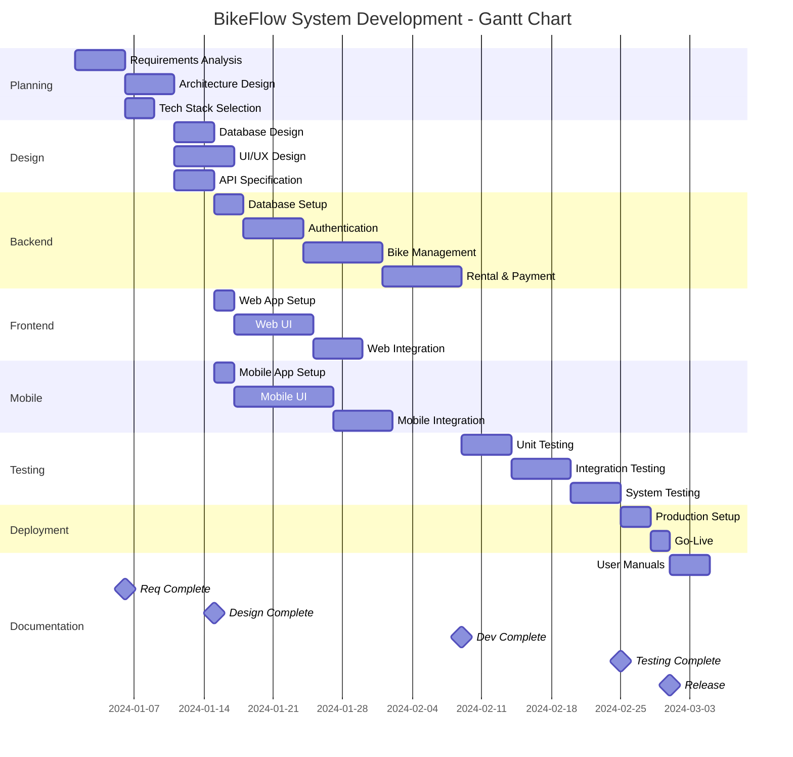

### Project Timeline Summary

| Phase | Start | End | Duration | Milestone |
|-------|-------|-----|----------|-----------|
| Planning & Analysis | Week 1 | Week 2 | 2 weeks | Requirements Done |
| Design | Week 2 | Week 3 | 2 weeks | Design Complete |
| Development | Week 4 | Week 10 | 7 weeks | Development Complete |
| Testing | Week 9 | Week 11 | 3 weeks | Testing Complete |
| Deployment | Week 12 | Week 12 | 1 week | Go-Live |
| Documentation | Week 12 | Week 12 | 1 week | Final Release |
| **TOTAL** | **Week 1** | **Week 12** | **12 weeks** | **Project Complete** |

## 4.2 Network Diagram (Critical Path)
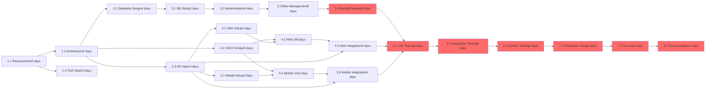

**Critical Path (highlighted in red):**
1.1 → 1.2 → 2.1 → 3.1 → 3.2 → 3.3 → 3.4 → 6.1 → 6.2 → 6.3 → 7.1 → 7.2 → 8.1

**Total Duration:** 12 weeks (60 business days)

---

### Resource Allocation
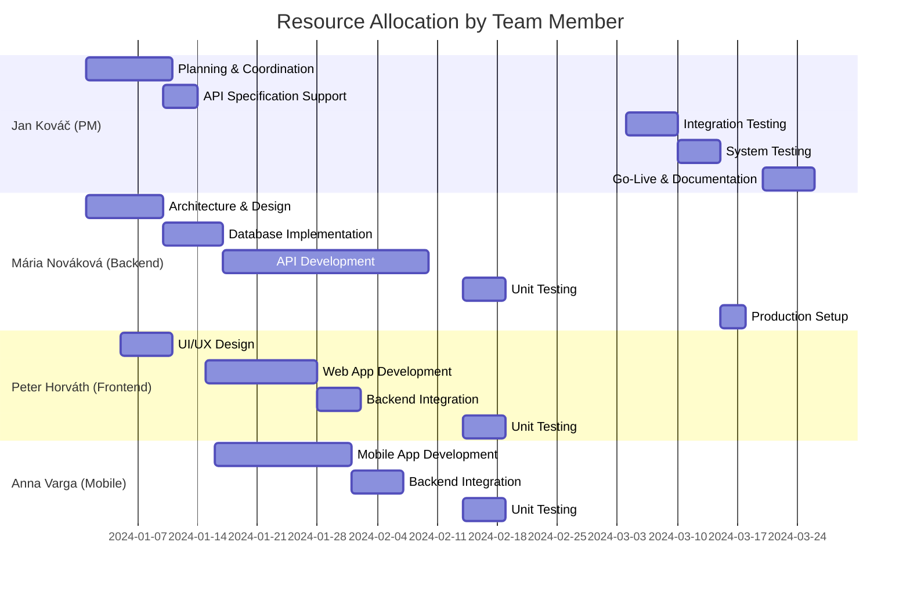

---

### Risk Analysis

| Risk | Probability | Impact | Mitigation |
|------|-------------|--------|-----------|
| Payment API delays | Medium | High | Start integration early, have backup provider |
| Scope creep | High | Medium | Strict requirements management, change control |
| Team member unavailable | Low | High | Cross-training, detailed documentation |
| Performance issues | Medium | High | Load testing early, optimization sprint |
| Security vulnerabilities | Medium | High | Code review, security audit before go-live |

------

**Document Version:** 1.0
**Last Updated:** [Date]
**Author:** David **Tsofin**

